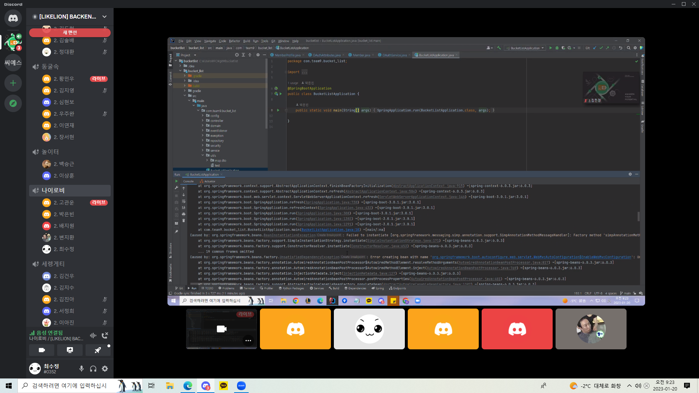

## 팀 구성원, 개인 별 역할

---

### 역할 지정
| Role | 이름 |
| --- | --- |
| PM | 최수정 |
| CTO | 정재현 |
| 기획 | 배지원 |
| 인프라 | 박은빈 |
| 프론트 | 고관운 |
| 개발자 | 변지환 |

### 역할별 내용

- **PM**
    - Daily 회의 진행
    - WBS 작성하여 프로젝트 일정 관리
    - 이슈 생성 · 관리 · Merge
    - 수시로 팀원들의 퍼포먼스 체킹
  
- **기획**
    - 기능정의서, 화면설계서, 기능흐름도, api 명세서 작성
    - 화면 설계 및 스토리보드 작성
    - 새로운 기능 구상
  
- **CTO**
    - ERD 작성
    - 공통 영역 개발
    - 기술 관련 의사 결정
    - 기술적 이슈 Cover

- **개발자**
    - 그밖에 CTO와 PM이 할당한 개발

- **인프라**
    - Build, Gitlab Repository, AWS, Docker, CI/CD 파이프라인 구성
    - 그밖에 CTO와 PM이 할당한 개발

- **프론트**
    - 프론트 용어 및 문법 숙지
    - 프론트 개발 시, 주도적으로 개발 방향 지시
    - 그밖에 CTO와 PM이 할당한 개발
    - 팔로워쉽

## 팀 내부 회의 진행 회차 및 일자
| 회차 | 날짜 | 불참 팀원 명 |
| --- | --- | --- |
| 1 | 1/16 | - |
| 2 | 1/17 | - |
| 3 | 1/18 | - |
| 4 | 1/19 | - |
| 5 | 1/20 | 정재현(결석) |

## 현재까지 개발 과정 요약 (최소 500자 이상)

---

### 1주차 팀원 수행 업무 요약

| Role   | 이름   | 수행 업무                                          |
| ------ | ------ | -------------------------------------------------- |
| PM     | 최수정 | - WBS 작성 및 역할 분배 - 게시글 기능 구현    |
| CTO    | 정재현 | - ERD 제작 - 회원가입, 로그인 기능 구현       |
| 기획   | 배지원 | - 스토리보드 제작 - map 기능 구현             |
| 인프라 | 박은빈 | - 서버 띄우기, 배포자동화  - 채팅 기능 구현   |
| 프론트 | 고관운 | - 프론트엔드 화면 구성 - SNS 로그인 기능 구현 |
| 개발자 | 변지환 | - ReadMe 작성 - 리뷰기능 구현                 |
|        | 함께   | - 기능정의서/Api 작성 - 프론트 템플릿 고안    |

### 개발 과정 설명

1. 시작에 앞서, 프로젝트 역할을 정했다. 선정 방식을 설명하기 앞서 우선 우리는 도메인 선택을 팀원들이 각자 생각한 아이디어로 발표를 한 뒤  그 중에 하나를 투표를 통해 정하는 방식으로 도메인을 정했다.  그리고  채택된 도메인을 구상한 배지원님이 자연스레 기획을 맡았으며 나머지 역할들은 본인이 원하는 역할로 자원해서 차례로 정하기 시작했다.
2. 개발을 본격적으로 시작하기 앞서,  협업 규칙도 정해야 하고 프로젝트를 문서화 할 게 많았다.

협업 규칙으로 브랜치/커밋 컨밴션과 Merge 규칙도 정하였고, 그것들을 노션페이지를 만들어 정리해서 헷갈릴 때 마다 보고 상기할 수 있도록 PM이 페이지를 제작했다.

스토리보드는 기획자가 만들고, ERD는 CTO가 만들고, 인프라개발자는 서버를 구축해서 빌드하고, PM은 WBS를 작성하고 나머지 팀원들이 기능정의서를 작성하며 문서화는 프로젝트 역할에 맞춰 분업화를 통해서 제작했다. 분업화를 통해 제작한 뒤, 함께 모여 회의 시간에 피드백을 하며 수정 및 본인의 파트를 설명했다.

3. 페이지의 프론트에 대해서 회의를 통해 투표를 많이 받은 페이지를 선정해 구매하였으며, 기능정의서에 request와 response 규격도 미리 정하자는 말이 나와서 다시 한번 정리하였다. 뿐만 아니라 스토리보드, ERD,  WBS 또한 계속 수정해야 했으며 이 과정에서 언제까지 회의를 진행해야하며 어디까지 맞춰야 할지 막막함이 몰려왔다. 개발도 하기 전에 대화를 하며 많이 지쳤다.

4. 개발을 본격적으로 시작하며, 기능정의서를 참고하며 기능별 순서를 적은 WBS에 따라 업무 분장을 하여 개발을 시작했다. 우선 역할에 상관없이 일정한 단위로 분장을 하였으며 개발 과정을 계속 살펴보며 알맞은 업무 분장으로 점점 개선해 나갈 예정이다. ReadMe는 개발자 한 분이 맡아서 진행해 주었다.

5. Merge 충돌이 심할 것 같은 Entity 부분을 미리 다 만들어서 먼저 push하였고, MVC 계층에 맞게 디렉토리 또한 미리 만들어서 push하였다. 그 후 깃랩에서 프로젝트를 clone하여 각자 브랜치를 또 만들어 기능개발을 시작했다. 역시나 개발을 시작하니 문서로 작성한 것들을 수정할 것이 많아 졌다.

6. Merge의 난. 각 자 기능 개발을 한 뒤 merge를 하려는데 생각보다 오류가 많이 떠서 애를 먹었다. 처음에 충돌을 피하려고 나름 계획적으로 접근했는데도 Merge로 거의 반나절을 날렸다.

### 소감

- 기술적으로 새로 알게 된 점
    - 협업 시 편리하려면 DB의 속성명과 java 코드에서 변수명이나 request, response를 확실히 맞추고서 하는 것이 혼동이 없고 편할 것 같다.
      그래서 다음에는 ERD로 Entity를 먼저 java 클래스로 만든 뒤, 그 변수들을 가지고 기능정의서에서도 코드 변수명을 통일시켜 정하는 게 나을 것 같다.
    - 커밋 메시지를 맞추는 것이 중요하다는 것을 깨달았다.
    - git이 어려웠는데 이번 기회로 merge와 pull 등에 대해서 공부할 수 있어서 좋았다.
    - Many to Many의 사용을 자제하고 하나의 새로운 테이블을 만들어 매핑시킨다
- 어려웠던 점
    - Merge, 어떻게 해야 충돌 안 나게 잘 할 수 있을지 명확한 규칙을 세우기 힘들며 여러명의 merge를 함께 하려니까 소통을 계속 하면서 해야 돼서 시간비용이 많이 든다. Merge를 자주 하고 pull 받는 것이 충돌을 제일 줄일 수 있는 방법이긴 하겠지만 시간비용을 생각해서 적절히 조절해야 될 것 같다.
    - 협업 그 자체
    - 혼자 작업을 할 때는 commit에 origin/main에 바로 push하면 됐는데, 협업에는 branch라는 것을 새로 생성해야 했다. 아직 완전히 이해한 게 아니라서 계속 공부를 해야겠다.
- 다음 주차로 넘어가면서의 다짐
    - 지금 고난과 역경은 git이다. 주말 동안 git 마스터 해보겠다!

## 개발 과정에서 나왔던 질문 (최소 200자 이상)

---

- 프론트에서 백엔드로 API통신을 하는 방법에는 무엇이 있을까
- toDto() 와 toEntity()는 왜 쓰이는건가
    - 우선 Dto와 Entity가 나뉘는 이유에 대해서 아는게 중요하다. Entity는 DB와 직접적으로 매핑되어 있고 해당 값이 자주 변경되면 여러클래스에 영향을 미치게 된다. 그래서 Dto라는 객체를 만들어서 View와의 중간다리 역할을 하게 함으로써 Entity의 변동성을 줄인다. Dto는 view에서 요청한 Entity의 일부 정보만을 잘라서 전달하고 가져온다고 생각할 수 있다.

  그런데, 보통 프로젝트마다 한 Entity나 Dto에 들어 갈 속성/변수값이 많으므로 질문의 메서드을 클래스에 넣어 다른 계층에서 쉽게 사용하기 위해서 만드는 것이다.
- 프론트엔드와 백엔드 사이에 Json으로 통신하는 게 좋을것 같은데 어떤 방식이 있을까
    - ajax

## 개발 결과물 공유

---

Github Repository URL: [S2uJeong / BucketList · GitLab](https://gitlab.com/S2uJeong1/bucketlist)

