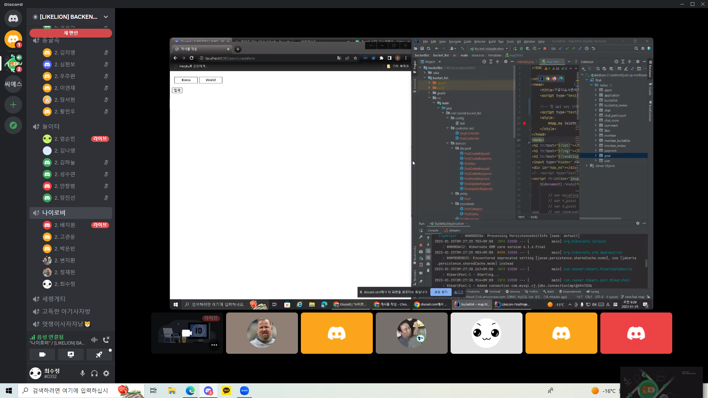

## 👩‍💻 팀 내부 회의 진행 회차 및 일자

---

| 회차 | 날짜 | 시간 | 불참 팀원 명 |
| --- | --- | --- | --- |
| 6 | 1/25 | 09:00 - 10:00 | - |
| 7 | 1/26 | 09:00 - 09:30 | - |
| 8 | 1/27 | - | - |

## 📈 개인별 역할과 현재까지 개발 과정 요약 + 소감

---

### 🙍‍♂️ 고관운

- SNS 로그인 : Google, Naver 로그인 구현 (oAuth2 활용)
- JWT : SNS 로그인 회원들에게 accessToken, refreshToken 발급
- 좋아요, 마이피드 기능 개발 중
- 소감
  - 일반 로그인 기능을 다른 팀원이 맡아서 진행했기 때문에 SNS 로그인 기능과 통합하는 과정에서 어려움이 있었다. 여기에 refresh Token까지 구현하니까 너무 힘들었다. 프론트에서는, 자바스크립트 부분이 매우 부족하다고 느껴져서 이를 보완해나갈 생각이다.

### 🙍‍♂️ 박은빈

- chat : 실시간 채팅 기능 구현 (websocket, sockJS, stomp활용)
- 신청서 : 신청서 작성, 리스트, 수락 거절, 카운트 api 개발
- 알람 : 좋아요, 댓글, 신청서 관련 알람 개발
- 소감
  - 생각보다 협업이란게 어렵고 힘들다 처음에 깃에서 머지하는데 에러가 너무 많이 뜨고 잘 모르겠어서 힘들었지만 이렇게 맞으면서 성장하는거같다. 앞으로 더 힘든일도 잘 해낼수 있을거같다

### 🙍‍♂️ 배지원
- 게시물 form, 프론트 서버 json 데이터 통신
- 위치에 따른 위/경도 추출하여 구글맵에 좌표 찍기
- 댓글, 대댓글 기능 구현
- 소감
    - 외부 API 사용을 처음해봤는데 내가 데이터를 넘겨주면 외부에서 가공해서 나에게 반환해주고 내가 해당 데이터를 사용할 수 있다는 점이 신기했다.
    - 대댓글을 진행하면서 모르는 부분들을 찾아보는데 처음 보는 정보들이 정말 많아 내가 부족하다는 것을 많이 느꼈다. 따라서 꾸준히 공부해서 내것으로 만들어 나가야 겠다.

### 🙍‍♂️ 변지환

- 멤버와 버킷리스트 게시물에 대한 리뷰
- 로그인 하지 않아도 열람할 수 있는 개인 프로필
- 소감
  - 이전 개인 프로젝트를 진행했을 때 반복되는 코드에 대한 리뷰가 많았다. 그래서 이번 프로젝트에서 리팩토링에 많은 시간을 들였다. 이전보다는 깔끔한 코드를 작성한 거 같아서 뿌듯했다.
  - 팀원들에게 질의하고 해소하는 과정에서 배워가는 것이 많았다. 나도 더 성장해서 도움을 주는 사람이 되고싶다.

### 🙍‍♂️ 정재현

- 일반 회원 가입, 로그인
- Refrsh Token 을 이용한 로그인 연장
- 로그인 여부에 따른 분기 처리
- 소감
  - API 프로젝트만 할 때는 단순히 데이터를 넘겨주는 것으로 끝났지만 프론트에서 데이터를 받아서 처리하는 과정을 새롭게 하니 어려웠고 시간이 굉장히 많이 소비되었다.

### 🙍‍♂️ 최수정

- Post : Update 기능 구현 및 form 형식 이용해서 리팩토링
- Git - Merge 어떻게 할건지 규칙 확정 + Merge 작업
- Post : 게시글 사진 첨부기능 추가
- 소감
  - 프론트를 포함한 완벽한 웹 페이지를 만드려고 하니까 알아봐야 할게 너무 많아서 애를 먹었다. 그래도 스웨거에서만 보던 웹 페이지를 프론트까지 해서 만든걸 보니 뿌듯하고 만들어진게 눈에 한 번에 들어와서 더 동기부여가  되었다.

  개발 실력들이 다 다르지만 서로 물어보면서 함께 성장해 나가는게 협업에서의 제일 소중한 경험인것 같다. 다들 부족한 나를 가르쳐줘서 고맙습니다
  (_ _ )(- - ) (_ _ ) (- - )/ -⭐

## ❓ 개발 과정에서 나왔던 질문

---

### 1️⃣ 게시물에 사진을 넣고 싶은데 어떤 방식으로 해야 가능할까?

------- 구현 후, 줄 글로 정리 예정입니다. --------

- **첫번째 방법 - 자바스크립트로 이미지 업로드 & 미리보기 기능 구현**

[javascript로 이미지 업로드 및 미리보기 기능 구현하는 방법](https://dahanweb.tistory.com/58)

[자바스크립트로 Image Upload 및 Preview 구현하기](https://iamiet.tistory.com/m/68)

- **두번째 방법** **- AWS S3 연동한 파일 업로드 구현**

[Spring Boot와 AWS S3를 연동한 파일 업로드(2) | 👨‍💻 Gradual Development (percyfrank.github.io)](https://percyfrank.github.io/springboot/S302/#3-%EC%97%90%EB%9F%AC-%ED%95%B4%EA%B2%B0)

- **세번째 방법 - 드래그 앤 드롭 라이브러리 사용**

[[Dropzone] 📚 이미지 & 파일 업로드 (드래그 앤 드롭) 라이브러리](https://inpa.tistory.com/entry/Dropzone-%F0%9F%93%9A-%EC%9D%B4%EB%AF%B8%EC%A7%80-%ED%8C%8C%EC%9D%BC-%EC%97%85%EB%A1%9C%EB%93%9C-%EB%93%9C%EB%9E%98%EA%B7%B8-%EC%95%A4-%EB%93%9C%EB%A1%AD-%EB%9D%BC%EC%9D%B4%EB%B8%8C%EB%9F%AC%EB%A6%AC-%EC%82%AC%EC%9A%A9%EB%B2%95)

### 2️⃣ change() 메서드의 도입 고민

게시글 수정 기능을 구현하는데 `@setter`를 안 쓰고 하려니까 변경할 내용을 Dto로 받아 값을 일일이 entity의 해당 값에 넣어주는 작업이 필요했다.

이 작업을 service 단에서 하게 된다면, 지저분한 것도 있지만 나중에 entity의 해당 값들이 어디서 변하는지를 set() 함수를 찾아 일일이 돌아다녀야 하므로 가독성이 좋지 않다고 생각했다.

그래서 Entity 단에 수정이 가능한 Post의 속성들을 지닌 Dto를 매개변수로 한 `change()` 메서드를 만들어 메서드의 기능이 어떠한지, Entity 속성 값 변경이 어디서 일어나는지 한번에 찾을 수 있도록 하였다.

### 3️⃣ 프론트에서 post형식으로 데이터를 보내는 방법

1. <form>태그 활용

   신청서나 글 작성과 같은 여러 데이터를 한번에 보내고 싶을때 form태그를 이용해 보낼 수 있다.

    ```html
    <form action="경로" method="get | post" name="전송될 데이터 이름" accept-chatset="문자 인코딩 방식" enctype="인코딩 타입">
    </form>
    ```

   post일때 컨트롤러에서 경로에 해당하는 메서드에 객체가 존재한다면 그 객체로 값이 전달된다

   get일때는 [www.naver.com](http://www.naver.com)/?id=1 과 같이 값이 전달된다

2. ajax와 같은 js 활용

   jQuery ajax를 사용하면 form보다 더 자세하게 데이터를 전달 할 수 있다.

    ```jsx
    $.ajax({
    	url         :   "/post/save",
    	method      :   "get | post | put | delete..",
    	header      :   "헤더 지정",
      dataType    :   "서버에서 받아올 데이터 타입 (json)",
      contentType :   "클라이언트에서 보내는 데이터 형식(application/json; chatset=utf-8)",
      data        :   JSON.stringify(데이터),
    	success     :   function(성공시 응답 데이터){},
    	error       :   function(에러시 응답 데이터){}
    });
    ```

   간단하게 get, post를 이용해 데이터를 보내고싶을경우 form을 활용하면 되지만 복잡한 데이터나 헤더추가, get post이외의 http방식을 활용하거나 에러처리와같은 일이 필요할때는 ajax, fetch, axios와 같은 통신 방법을 사용


## 개발 결과물 공유

---

**코드 리포지토리**

[S2uJeong / BucketList · GitLab](https://gitlab.com/S2uJeong1/bucketlist)

**회의 사진**


